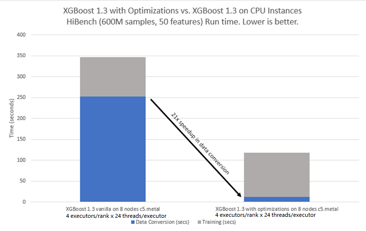

#####################################################
XGBoost4J-Spark With Arrow Datasource Tutorial
#####################################################

********************************************
Prerequisites
********************************************
The optimization depends on Apache Arrow 3.0 and Arrow data source in OAP 1.1 release. Arrow data source is part of Spark's native SQL engine plugin developped by Intel. Native SQL engine is realsed as part of OAP project. But to enable the optimization you don't need to build or install full OAP packages or Native SQL engine packages. Just the Arrow data source plugin is enough. 

You can find more infomation from `OAP project <https://github.com/oap-project>`_ and `Native SQL Engine project <https://github.com/oap-project/native-sql-engine>`_

The optimization and OAP 1.1 works Spark 3.0.0. 

Install Pre-built Arrow Data Source Plugin
===================================
The easiest way is to download the pre-built arrow data source plugin from `maven <https://repo1.maven.org/maven2/com/intel/oap/spark-arrow-datasource/1.1.0/>`_

Build Arrow Datasource Jar
===================================
Or you may build the arrow data source by yourself. You may refer to `Unified Arrow Data Source <https://github.com/oap-project/native-sql-engine/blob/master/arrow-data-source/README.md>`_  to compile the spark-arrow-datasource*.jar. Be sure to switch to branch branch-1.1-spark-3.x.

Build And Install Apache Arrow
===================================
.. code-block:: none

  // build arrow-cpp
  git clone --branch native-sql-engine-clean https://github.com/oap-project/arrow.git
  conda create -y -n arrow3.0_dev -c conda-forge --file arrow/ci/conda_env_unix.yml --file arrow/ci/conda_env_cpp.yml --file arrow/ci/conda_env_python.yml --file arrow/ci/conda_env_gandiva.yml compilers python=3.7 pandas
  conda activate arrow3.0_dev
  export PATH=$CONDA_PREFIX/bin:$PATH
  cd arrow
  git checkout arrow-3.0.0-oap-1.1
  cd arrow/cpp
  mkdir build
  cd build
  cmake -DCMAKE_BUILD_TYPE=Release -DCMAKE_INSTALL_PREFIX=$CONDA_PREFIX -DARROW_DEPENDENCY_SOURCE=BUNDLED -DARROW_PARQUET=ON -DARROW_HDFS=ON -DARROW_BOOST_USE_SHARED=ON -DARROW_JNI=ON -DARROW_WITH_SNAPPY=ON -DARROW_WITH_PROTOBUF=ON -DARROW_DATASET=ON ..
  make
  make install

Use Pre-built Arrow
===================================
Instead of building Apache Arrow from source, alternatively a much easier way is
to use a pre-built Arrow. For example, the following steps show how to install
Apache Arrow using conda:

.. code-block:: none
  conda install pyarrow=3.0.* -c conda-forge

Either building Arrow from source or using a pre-built binary, we need to set up ARROW_HOME and 
LD_LIBRARY_PATH environment variables before we build XGBoost:

.. code-block:: none

  export ARROW_HOME=/path/to/arrow/installation  #like $CONDA_PREFIX
  export LD_LIBRARY_PATH=$ARROW_HOME:$LD_LIBRARY_PATH

Building Java package from XGBoost Source Code
================================================

To avoid issues caused by complex dependences and mismatching system
libraries, the easiest way of building XGBoost is to do it in the same conda environment
where Arrow is installed (see above). We install essential build tools including
GCC, cmake, git and Maven in the environment, and then initiate the build
process from the same environment. The steps are:

.. code-block:: none

  conda install gcc_linux-64=9.3.* maven git cmake -c conda-forge
  git clone https://github.com/Intel-bigdata/xgboost.git -b arrow-to-dmatrix
  cd xgboost/jvm-packages
  mvn clean package -DskipTests 

Then you can get the ``xgboost*.jar`` and ``xgboost-spark*.jar`` in ``./xgboost4j-spark/target/`` and ``./xgboost4j/target/`` paths.

Download Spark 3.0.0
================================================
Currently xgboost spark with Arrow datasource optimization works on the Spark 3.0.0 version.

.. code-block:: none

  wget http://archive.apache.org/dist/spark/spark-3.0.0/spark-3.0.0-bin-hadoop2.7.tgz
  tar -xf ./spark-3.0.0-bin-hadoop2.7.tgz
  export SPARK_HOME=``pwd``/spark-3.0.0-bin-hadoop2.7

********************************************
Get Started
********************************************
The `notebook <https://github.com/oap-project/solution-navigator/blob/master/xgboost/xgboost-example.ipynb>` walks through the basics of using the Arrow datasource optimization and the limitations

********************************************
Performance
********************************************
The performance Compared to upstream xgboost

********************************************
Note
********************************************
You don't need to use the ``VectorAssembler`` to assemble ``feature`` columns before training. 
Parquet's data type must be float or double. The optimization doesn't support other data type yet.
Currently this optimization doesn't support ``limit``, ``coalesce`` and other sql operators, and we will support more operators in the future.
